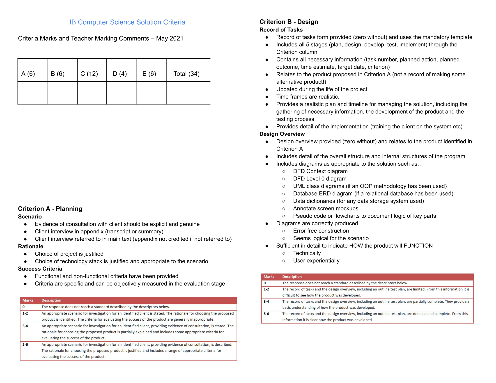
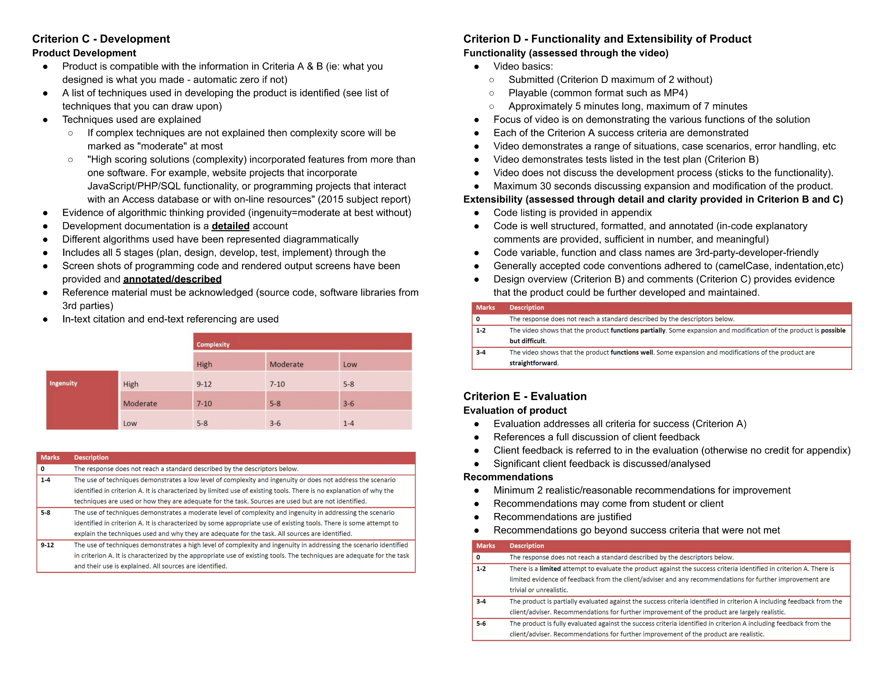

import Callout from '@/components/Callout.astro'

# Part 1: Introduction

For some context, this guide was written because my peers and I found our journey through CS30 IB to be difficult and overwhelming as a result of the limited resources and
unclear information surrounding the course. This was written with the intention to help some of you out, to get the ball rolling, so that theres a clear framework on how to 
approach the course effectively. <Callout variant="warning">There is no guarantee that this guide is perfect--it's likely to contain several errors--but most of the information has been presented through
personal experience and research so as to aid in your completion of the course. </Callout>

## 1.1: What is the Internal Assessment

In a nutshell, the Internal Assessment for CS30IB is a practical project where you reach out to a client and develop some sort of software or product; usually a website, mobile application, or video game. 

## 1.2: Criteria and Rubric

The criteria for the internal assessment is standardized and is shown below for each of the sections being marked. It's recommended to refer back to it regularly.

## 1.3: Finding a Client
Unlike other IA's, you need to find a client for this project. Generally, the following groups of people are recommended to reach out to:

- Parents, siblings, or relatives: This is probably the easiest method and is recommended because of its flexibility. Most people should choose this option.
- Teachers or school staff: Also easy to get a client this way. However, there is much less flexibility in both software requirements and communication as most teachers/staff are busy. 
- External persons: This is much harder, but if you have the connections (to a business for example), it can be a viable option as well. Flexibility varies between individual clients, 
but generally there isn't as much freedom.

You can have a close friend (or even yourself) be a client, but it's highly recommended against. IB has a record of marking lower on projects with these types of clients.

<Callout variant="danger">
Please do not accept a request for a highly complex project as it will only make your life harder. 

There is more on this topic to be discussed, but IB markers don't care about the complexity of your program itself. They mostly care about how complex you make the program seem 
on your writeup. With this in mind, accept a project with a simple set of features and instead use extensive techniques (complex algorithms and data structures) to 
expand on your code. 
</Callout>

<Callout variant="tip">
It's extremely advised to find a client within the first 2 weeks of school to allow time for planning and Section A.
</Callout>
## 1.4: Timeline

Your teacher will give you general due dates on when certain parts of your IA are due. It's important to adhere to these due dates if possible, especially near the end 
of your IA, as you will begin to see an increase in workload and will not have time to work on your project.

The general timeline is as follows:
| Time Period         | Tasks                               |
|---------------------|--------------------------------------|
| September           | Client discovery and Section A       |
| October–November    | Learning Fundamentals and draft of Section B     |
| December–January    | Learning Advanced Concepts, starting Section C, and finishing Section B               |
| February            | Section D and Section E              |

<Callout title="Late stage planning risk"variant="warning">
Your IA will be due in sometime after February, likely March or April, however, it is *highly* recommended that you hand it in by late february or early March at the latest.
You will likely be much busier at this time and the addition of extra content to your writeup or project will net diminishing returns. 
</Callout>
# Part 2: Writeup Guide
This section is only meant to serve as a guide, not a step by step tutorial, so essential points are kept concise. A general overview of 
what to expect for each section will be given by your teacher. 

<Callout variant="important">
Make sure you follow your teacher given exemplars religiously. This is very important. 
</Callout>

<Callout title="Writeup remarks" variant="tip">
- It's recommended to use Times New Roman or Arial. Size 12, 15, and 18 for normal text, small heading, and large heading respectively.
Its important to keep this consistent among all sections. 
- The title of all your main section documents should be in the format "Criterion X: Name of Section." Example: Criterion C: Development. This should be a large heading.
- Keep all your writeup files in a folder within your Google Drive to stay organized.
- Sections should be named "Crit_X_Y", where X is a letter and Y is the section name (example: Crit_A_Planning). Appendices should be named Appendix_A and Appendix_B. 
- Always keep referring back to your client conversations in your appendix constantly throughout all sections. In your document, it should look like "(Conversation X, Appendix Y)" where X is a number and 
Y is a letter (example: Conversation 1, Appendix B). It's important to note that references to your appendix are not considered towards your word count. 
- After handing in your section to your teacher on classroom, follow their commented advice. Look through each point of feedback and fix whatever they feel is wrong. 
</Callout>
## 2.1: Section A
<Callout variant="note">
Section A is meant to be short and completed within the first month of the school year. This is your chance to get some easy marks. 
</Callout>

For your scenario, talk concisely about your clients problem, what solutions they tried previously, and a vague description of what they want--including features and type of application.
Refer back to your appendix as much as possible here. 

For your rationale, talk about what application you're making, what features it will have, and what technologies/frameworks you are using to accomplish it (and why those certain frameworks are being used).

Your success criteria should consist of 7 bullet points--no more and no less. All bullets must concise and relate to each feature that your client wants. 

## 2.2: Section B 

Section B is more difficult, especially since you likely won't have a clue on the structure of your program. Therefore, it's recommended to do a couple parts of section B and add more as you
finish developing. This consists of adding vague structure based diagrams that don't require you to have started coding. 

Your "Test Plan" should be a copy paste of your requirements from Section A, with your test plan steps being your process to check if each requirement is met. Be as specific as possible. 

<Callout title="Good vs bad test plans" variant="example">
A bad example of a test plan is the following: 
- "Try adding an item and see if it shows up on my web page." 

A good example of a test plan is the following: 
- "Log in as the client and navigate to the catalogue
page. Attempt to add a new item, such as a 'Caliper' and observe if the item appears instantly in the inventory list with all entered details. Modify the item by updating fields like quantity,
and confirm that the change is immediately reflected in the list. Finally, delete the item and check that it is fully removed from the inventory."
</Callout>

Some diagrams to include in Section B (you can put much more than just these): 
| Before Development               |After Development                    |
|----------------------------------|-----------------------------------------|
| UI Mock Ups                      | UML Class Diagram (if applicable)       |
| Context Diagram                  | Algorithm Flowchart                     |
| Top Down Diagram                 |                                         |
| System Flowchart                 |                                         |

<Callout title="Section B efficiency" variant="tip">
As of writing, these were the only diagrams I put on my IA, with minimal effort, and managed to get the same mark as some of my other peers (who spent significantly more time). 
Section B is not worth spending as much time on as it may seem. It's important to focus on quality over quantity here. All diagrams should be comprehensive, easy to see, and well structured. 
</Callout>

Section B also consists of a record of tasks. This part is more flexible, so feel free to write with your preferred style and don't take too long. Make sure that you have about 50 tasks 
and that you are constantly referencing your appendix for client interactions. Moreover, avoid discussion of your writeup.
## 2.3: Section C 

Section C will be the bread and butter of your IA. I would recommend spending some time on this section as it's worth double the other sections.  

Again, your teacher will likely give more details about this section and what to expect. It's highly advised to look at their commentary when you 
hand in your draft.

<Callout title="IB code guidelines" variant="note">
You'll be taking a lot of screenshots of your code so it's important to remember a couple of things. Firstly, make sure that when taking screenshots, your background
color is light. No dark themes allowed. 

Moreover, it will be difficult to fit all of your relevant code in a single screenshot so it's advised that you only screenshot the fundamental portion of your code.
</Callout>

When writing about the structure of your code in Section C, you should look back to your Section A and take excerpts from your rationale. In the structure you will
mostly need to talk about the different layers of your program and the technologies you're using (and why you're using them). 

Your teacher will give you a list of techniques so you'll just need to browse through them and put in the ones you used and add others that were not covered.

The actual writeup and difficult portion of Section C will consist of writing about 9-10 different parts of your program. For each part you need to take screenshots of the relevant code 
and write about the purpose of that code and techniques implemented in it. Each explanation should no larger than a very short paragraph. Be concise and make your code seem complex.

Make sure to put a reference (APA style) of all resources used to develop your program at the end.
<Callout title="Integrating Section B and Section C" variant="tip">
It's highly recommended to copy paste all if not most of your figures from Section B into Section C for the relevant part of your code. IB markers will look for some sort of 
integration with Section B so this is mandatory.
</Callout>

## 2.4: Section D

Section D consists of an Extensibility portion and Functionality (video) portion. Generally, this section is not very difficult.

For the extensibility portion, copy paste your teacher given extensibility techniques list and color key highlight each technique used in your doc (use whatever colors you want). 
Afterwards, copy paste *all* your essential code and highlight each relevant portion of your code that applies to your key. 

<Callout variant="note">
If your code is too long to key everything, make sure to indicate to the marker that you will only key the first 10 pages or so of your extensibility document.
</Callout>
For the video portion, all you need to do is create a video 4-7 minutes long where you do the following:
1. Go through your exact test plan in Section B
2. Explain at least 3 extensibility features to add in the future (last 30 seconds of the video)

<Callout variant="warning">
Speeding up your video will end up in you getting potentially 0 for that section. If your video is longer than 7 minutes, your test plan is too long
and you are wasting time.
</Callout>

## 2.5: Section E

Section E is the easiest of all the sections.

For the first part, copy paste your exact test plan from Section B into your document and indicate whether each criteria was met or not. How you do this 
is up to you. 

For the client feedback, keep it concise and talk about whether your client found your product to be satisfactory or not, what they wish could be implemented,
things to improve, etc. Keep this section very short.

Finally, you'll need to talk about your 3 future improvements. For each improvement, write a very short paragraph explaining how this would help your client. 

## 2.6: Appendices 

Your appendices are not directly marked but the IB marker will refer back to them.

Appendix A is for you to list all the resources you used during your IA. This includes all websites, books, videos, etc. that you used. Make sure to cite it in 
APA format. This should be similar if not the same to your references in Section C.

Appendix B is mostly going to contain transcripts of your client conversations. You can put any other relevant information that you want the IB markers to refer back in this 
Appendix. 

# Part 3: Development Roadmap

During the planning stages of your IA, the distinction should be made that Web Development is the most efficient route to take in order to get a high mark without investing
too much time into your project. As such, the first section of the roadmap will deal exclusively with Web Development. 

However, it's important to discern whether your product should be a website in the first place or if it's more appropriate to create a local application (like a Windows program). 
This guide won't cover how to create local desktop applications as it's uncommon in most cases for an IA (and often too time consuming), but if you want to anyhow, the internet 
is a great place to start. 

[Read the Web Dev Roadmap](/blog/cs-guide/web-dev). 
# Part 4: Tips and Advice

