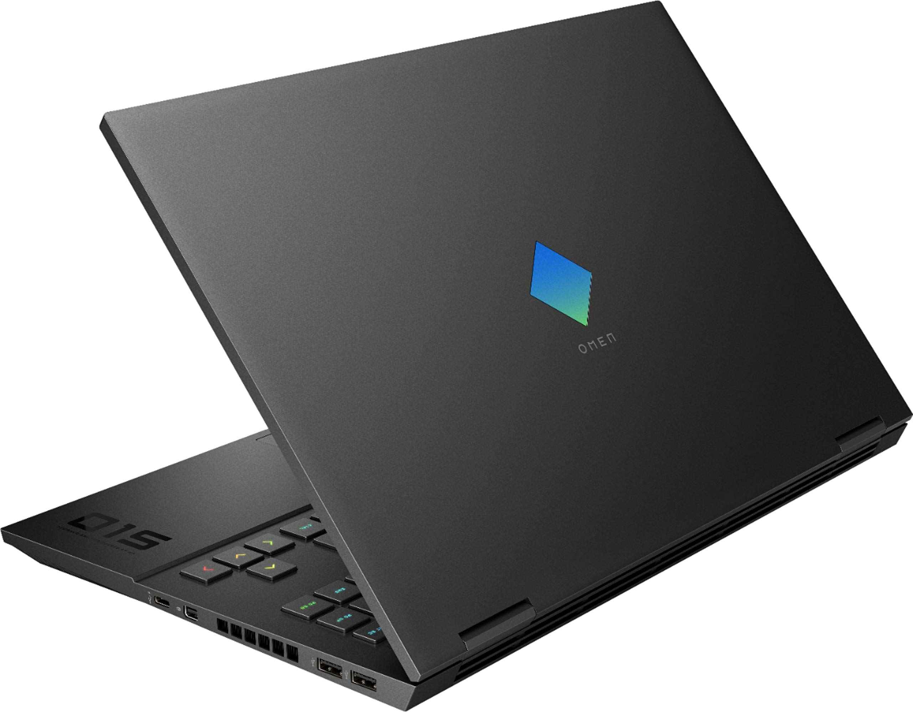
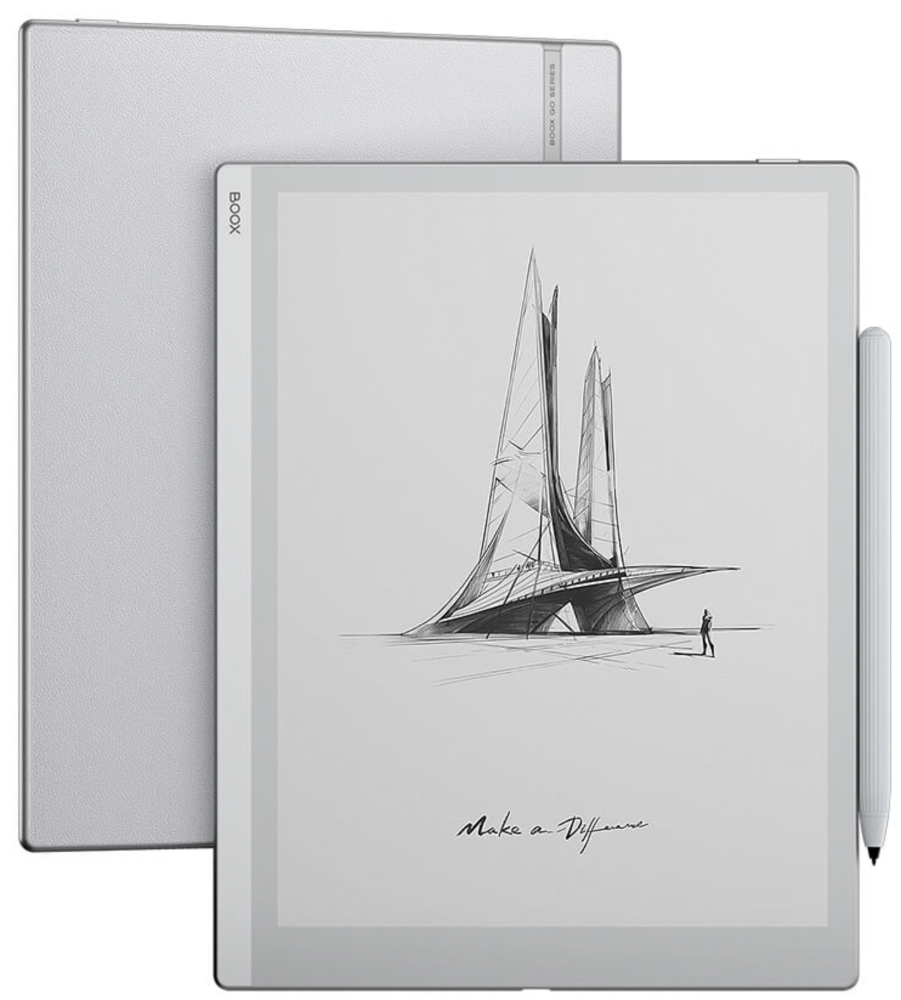
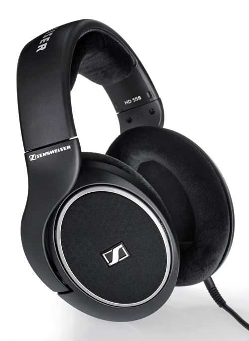
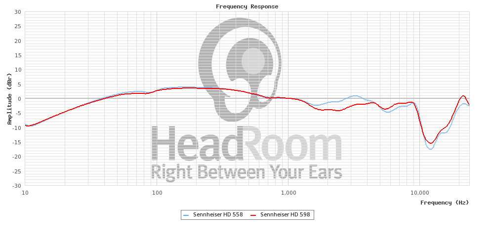
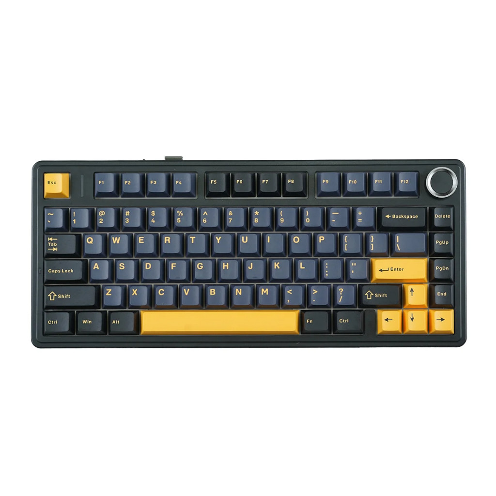
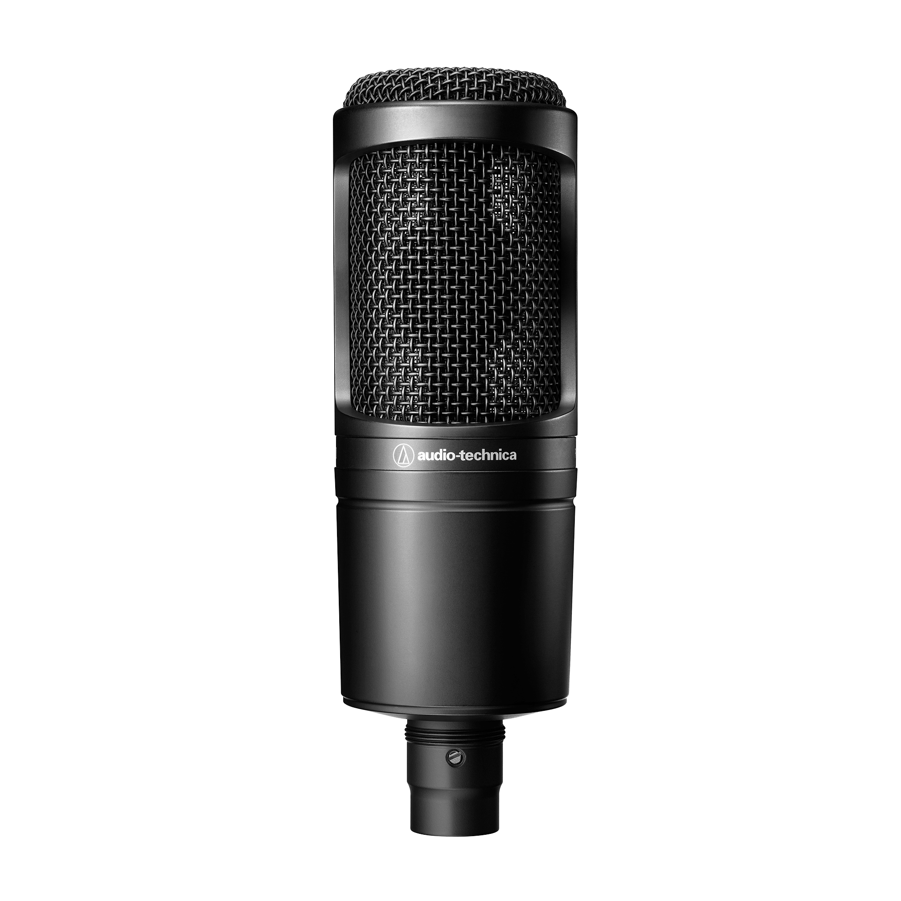
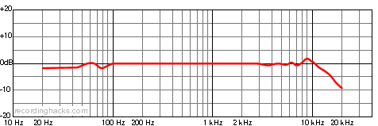
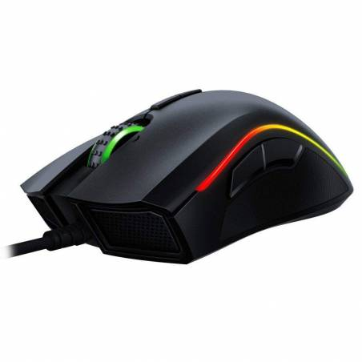
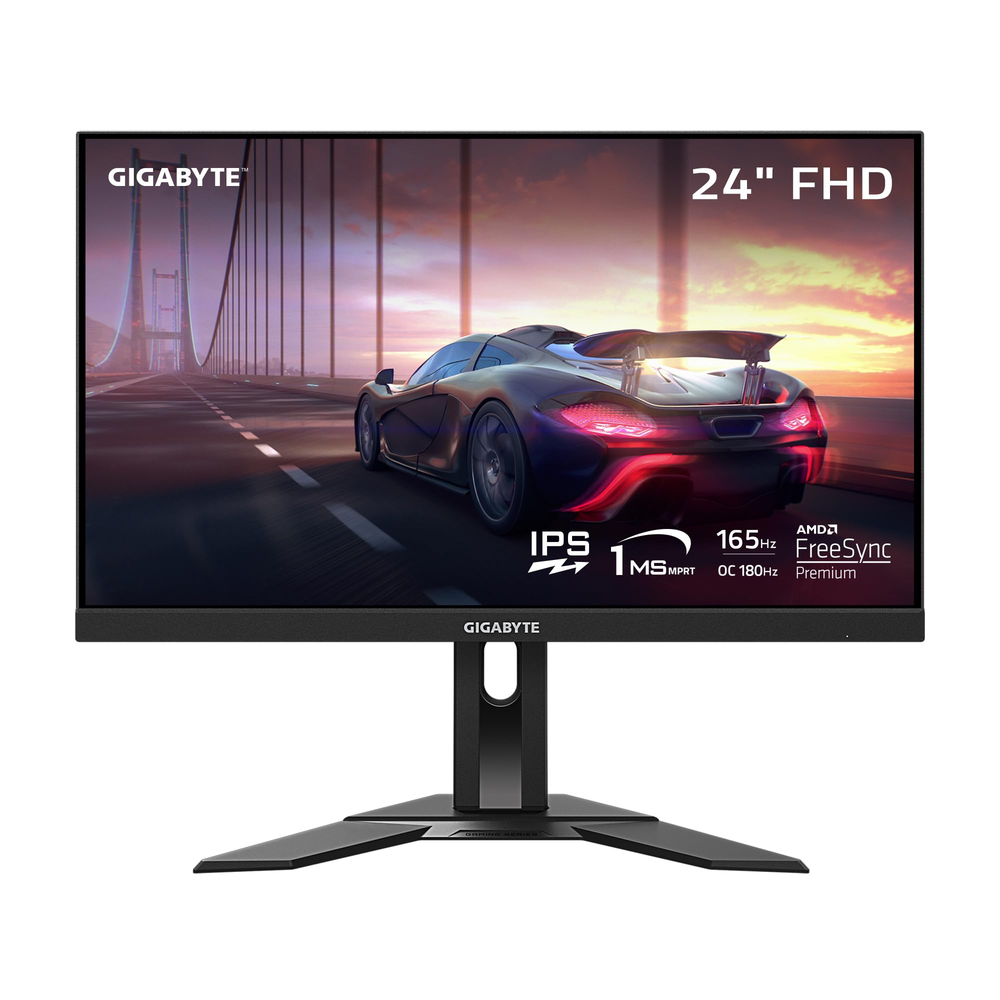

## Preface

Before I discuss the tools I use in my workspace, it should come to no surprise that all the things that I use have been stockpiled
for years or months. It is of importance that I describe the idea that true value and benefit is reached only when you only have all that you need and
nothing that you do not--that is, complete minimalism. 

I should also mention that a lot of my tools are bought used. Why? Because there's no reason why you shouldn't buy used if your 
requirements are met. Most people should realize that the phase of awe and pure interest that you feel when you buy a new product is mostly 
short-lived. After some while, it becomes purely a part of your life--and of course that makes it lose it's significance. 

Regarding
the topic of security, I agree to some regard that new products can bear some of the burden as you'll actually get reimbursed for any faults in a product, 
but I believe that as long as common sense is used, there should be no reason you cannot feel a sense of security with buying anything used. 
If a product can be tested on site, shows little damage, and is being sold by a seller who isn't suspicious, you're unlikely to be swooned.
It's for this reason that I buy used items a lot of times. It's environmentally friendly, fast, and of course: cheap. 

## Laptop: Omen 15 (2021 Model) 

If I had to describe it in one word it would be this: workhorse. I bought this brand new (on sale) around September of 2021.
This is what does all of the heavy lifting in my workspace.

#### The Specs:
- CPU: Ryzen 5 5600H 
- GPU: RTX 3060 (100W)
- RAM: 16GB DDR4 3200Mhz
- NVME SSD: 1TB (upgraded to 2TB)
- DISPLAY: 1080p 144hz

If you look at the specs you'll realize that it isn't very fancy at all--but that's it's greatest strength. You see, it has exactly enough 
power to play any games that I want, run any program that I want, and do whatever I desire to a great enough capability--one that is within the
of the perfect 'sweet spot' of price to performance--such that I don't need anything more powerful. 

I think this purchase decision is by far the best one i've made in my life as it allowed me to properly access the world wide web and enjoy the world of 
computing to it's fullest extent. In fact, my username is based on the GPU architecture (ampere) of it's 3000 series Nvidia GPU. 

I believe that we've come to a point where the demands of modern software (aside from videogames) are stalling, while the hardware capabilities of new computers are steadily
getting more optimized and efficient, even if it's not to the extent of Moore's Law in previous decades. 

## Tablet: Onyx BOOX Go 10.3

This is the first unique tech choice in my arsenal that I bought new and should talk about. If you haven't noticed already, the BOOX Go 10.3 is an e-ink tablet--and a 
good one at that.

Despite being technology and computer oriented, i'm not a big fan of consumerism and the over-reliance of tech in the modern age. I believe it's a 
distraction that limits people--including me--from reaching their full potential.

There are plenty of people who are willing to argue for digital minimalism in my stead and as such I won't talk further. All I want to say is that I 
bought this to prevent myself from being distracted and instead be productive. And for that, I've compiled a list of reasons as to why this was so tempting:

- **It's e-ink**, which is the most important part, because I won't be distracted as the nature of the technology itself is unrewarding to the brain, but moreover, because it uses suspended ink 
particles instead of LED's, the display is similar to a physical book--friendly to the eyes and brain
- **It has a pen**, meaning I can write easily on it and not have to store physical notebooks
- **It's _extremely_ thin and light** which makes it easy to move around and use (plus it's a deisgn feat I appreciate)
- **It has a large screen** which is A5 so I can read (for projects and assignments), without lugging around physical books
- **It's android based** so the experience is more customizable unlike other e-ink devices
- **It has a long battery life** since eink doesn't continually refresh

## Headphones: Sennheiser HD558 

Now, this is something I bought used--and for good reason--as they were in great condition and came _cheap_. 

I should mention that these are somewhat old headphones, but that's not a problem in my opinion. The circuitry of a modern pair of headphones is so simple that large
advancements have been made decades ago (flashback to the legendary HD600's, first released in 1997). 

My thoughts on these are fairly simple: I just love them. 

For the price, they are extremely high-resolution (meaning low harmonic distortion), comfortable, wide in soundstage, and fairly neutral. Additionally, 
they came pre-modded with the foam mod such that they sound very similar to the more expensive HD598's. 

Frequency response curve of the modded HD558's below, courtesy of it's review on https://marlene-d.blogspot.com/2014/04/review-sennheiser-hd-558-modded.html

## Keyboard: Aula F75

This is the keyboard I currently use, having bought it new a year ago. 

Interestingly, I bought this before it went viral when the product only had maybe a dozen or so reviews. I'm glad, however, that these are popular nowadays. There are other's 
who can review this in depth, but they all will likely say the same thing: It's perfectly awesome. It's not the highest quality, nor the best sounding, or best feeling, but 
it's a great deal. This is designed so well that no modding is required; gasket-mounting, good stabilizers, rgb (whoooo!), wireless capability, 75% layout, etc. 
It's got it all. 

However, despite saying there's no need to mod this, I had to switch out the default switches with Akko Cream Blues because I cannot stand linears, which is of no confession that 
the stock switches aren't good--in fact they're great. It's simply a matter of personal preference as I like my tactile feedback.

Here is a decent review if you're curious:

    <iframe
    width="560"
    height="315"
    src="https://www.youtube.com/embed/TqPJw98zj7k"
    title="YouTube video player"
    frameBorder="0"
    align="middle"
    allow="accelerometer; autoplay; clipboard-write; encrypted-media; gyroscope; picture-in-picture"
    allowFullScreen
    ></iframe>

## Microphone: AT2020 USB

This is a cardoid condenser microphone that I bought used--again, for _cheap_.

A lot of people are likely going to go nuts over the fact that I didn't pick up the XLR version, but I stand my ground. Not only does the XLR version require
phantom power via 48V DC, which can only be supplied via an audio interface that costs more money and takes up more space, but the XLR version has very little improvement compared 
to it's USB counterpart. Hooking up a microphone to an interface will reduce noise and give more clarity generally, but assuming you're going to compress the audio
in the end anyway, the price increase will simply not be worth it--especially for a casual user like me. 

In terms of sound, it's great. It has a nice, flat, and highly detailed frequency response, making my voice sound more flattering than it likely
is. Moreover, it looks sleek and beautiful as well, being made of a highly durable all metal encasing. There is background noise as it is a usb condenser microphone, but 
it can be easily removed using something like [Audacity](https://www.audacityteam.org/)'s noise removal filter after recording. 

Frequency Response of the AT2020 USB:

With a cheap boom arm and pop filter, it's overall a great microphone.

Here is a decent review for those who are curious:

    <iframe
    width="560"
    height="315"
    src="https://www.youtube.com/embed/kCvl1ns5Qrc"
    title="YouTube video player"
    frameBorder="0"
    align="middle"
    allow="accelerometer; autoplay; clipboard-write; encrypted-media; gyroscope; picture-in-picture"
    allowFullScreen
    ></iframe>

## Mouse: Razer Mamba Elite

I bought this used when I was in 6th grade so i've had it for a very long time. I don't have many thoughts because it's really only a mouse.
It's nice, decently built, fast, and beautiful. It's wired so it's not very convenient, but it's fine.

However, I had a scrolling problem halfway through it's lifecycle and had to go inside of it to fix the issue. Aside from that however, it's been a pretty
smooth experience so I probably won't replace it until it breaks or becomes cumbersome to use. 

I wouldn't recommend this as gaming mice have skyrocketted in performance and affordability since it's original purchasing, but I still like it.

## E-reader: Kobo Clara HD

The Kobo Clara HD is something that I bought used, and again, for very cheap. 

Before knowing about e-ink devices, I was a skeptic of the technology. I couldn't believe that a screen with embedded ink
particles would be better than a regular book or smartphone, and well... I was wrong.

There are so many reasons why I bought this and why I still use it, so in order to keep it brief, i'll list the major reasons below:

- **Small and lightweight** with a screen size of only 6"
- **Kobo's own software** (which is easy to use and customizable), which means I don't have to deal with the integrated experience of a kindle or an inefficient BOOX device
running unoptimized android
- **Storage** that allows me to have 1000's of books within the palm of my hand
- **E-ink display**, meaning my eyes are saved
- **Long battery life**, counting it's lifecycle in weeks instead of hours
- **Built-in OverDrive**, meaning I can read ebooks from the library _completely free_

The biggest reason for me using an e-reader is the convenience. There's something special about physical books, but
I just can't look past the convenience of using an e-reader that is directly catered to reading.

## Monitor: Gigabyte G24F2

I got this monitor as a 'gift', so I can't say particularily much about it's purchasing value, but I like it. It's nice and sleek,
smooth, colorful, and generally decent.

The specs are as follows:

- Resolution: 1080p
- Refresh Rate: 180hz
- Display Type: IPS
- Response Time: 1ms (MPRT)
- Coverage: 95% DCI-P3, 125% sRGB

My favourite part is it's color coverage. It's not particularly color accurate so it's not well suited for production demands,
but for a casual user like myself, the extra colors given with 95% DCI-P3 are nice to have when programming, watching movies, playing games, etc.

Hardware Unboxed has an excellent review on the unit here:

    <iframe
    width="560"
    height="315"
    src="https://www.youtube.com/embed/HlsGvOV-Y74"
    title="YouTube video player"
    frameBorder="0"
    align="middle"
    allow="accelerometer; autoplay; clipboard-write; encrypted-media; gyroscope; picture-in-picture"
    allowFullScreen
    ></iframe>

It's not particularily great, but it's not a terrible option either. 

## Conclusion

I haven't covered everything here as things like mousepads, monitor arms, etc. are all tools that don't really have much significance 
and are well suited by whatever you're able to find. 

Moreover, I want to end off by saying that most of the stuff I use isn't necessary whatsoever for my work. I've lived happily and with little regret
without having what I have now. Really it's all a comfort. What I will say though, is that all of these are some important comforts that have increased my quality of life.
What matters aren't your tools, but how you use them in the first place, and there is no mistake that my brain is by far the most valuable and potent tool I have 
right now, even if it's not perfect. 